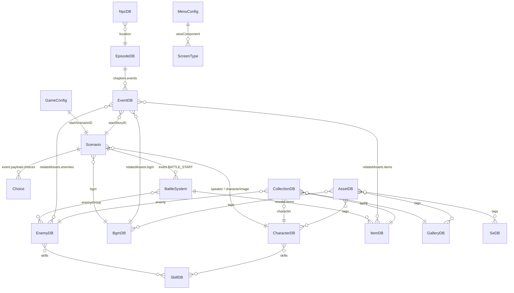

# NanoNovel JSON設計書

> **Version**: 1.0  
> **Date**: 2026-03-11  
> **Project**: NanoNovel — JSON駆動型ノベルゲームエンジン

---

## 目次

1. [設計思想](#1-設計思想)
2. [DONE設計（段階的リリース）](#2-done設計)
3. [ゲーム構成（3要素）](#3-ゲーム構成)
4. [JSON一覧とカラム定義](#4-json一覧とカラム定義)
5. [JSONサンプルデータ](#5-jsonサンプルデータ)
6. [Screen構造](#6-screen構造)
7. [データ構造図](#7-データ構造図)
8. [JSONスキーマ](#8-jsonスキーマ)
9. [Debug機能（JsonAttachment）](#9-debug機能)

---

## 1. 設計思想

### JSON駆動開発

NanoNovelは **「ゲームロジック」と「ゲームコンテンツ」を完全分離** する設計思想に基づく。

```
┌─────────────────────────────────┐
│     React View Engine           │  ← ロジック（コード）
│   JSONを描画するビューエンジン    │
├─────────────────────────────────┤
│     JSON Data Layer             │  ← コンテンツ（データ）
│   差し替え可能なゲームデータ      │
└─────────────────────────────────┘
```

**原則**: JSONのみ差し替えることでゲームを拡張できる構造とする。

### タグ駆動アーキテクチャ

アセット参照にはファイルパスではなく **タグ (tag)** を使用する。
エンジンはタグに基づいてAssetDBから適切なアセットを解決する。

---

## 2. DONE設計

### DONE01（プロトタイプ）

最低限動くゲーム。

| 必要JSON | 役割 |
|---|---|
| `GameConfig.json` | ゲーム全体設定 |
| `Scenario.json` | シナリオ会話データ |
| `AssetDB.json` | アセット管理DB |

**動作フロー**: `Title → Novel → Result`

### DONE10（拡張設計）

機能ごとにJSONを分離。

| 追加JSON | 役割 |
|---|---|
| `BattleSystem.json` | バトル設定 |
| `CollectionDB.json` | 図鑑・コレクション |
| `ScreenConfig.json` | 画面遷移定義 |
| `CharacterDB.json` | キャラクター情報 |
| `ItemDB.json` | アイテム情報 |
| `EnemyDB.json` | 敵情報 |

### DONE20（リリース状態）

| 追加要素 | 対応JSON |
|---|---|
| メニューUI | `MenuConfig.json` |
| セーブ/ロード | `SaveConfig.json` |
| BGM/SE | `BgmDB.json`, `SeDB.json` |
| ギャラリー | `GalleryDB.json` |
| NPC | `NpcDB.json` |
| エピソード管理 | `EpisodeDB.json` |
| クエスト管理 | `EventDB.json` |

---

## 3. ゲーム構成

```
NanoNovel Game
├── ① Novel（ノベルパート）
│   ├── シナリオ会話
│   ├── 分岐選択
│   └── イベント発火
├── ② Battle（ゲーム要素）
│   ├── コマンドバトル
│   ├── 脱出ゲーム
│   └── クッキーゲーム（カウントアップ画像変化）
└── ③ Collection（マスターDB）
    ├── キャラクター
    ├── アイテム
    ├── 敵図鑑
    ├── CG / ギャラリー
    ├── 称号
    └── アセット管理
```

---

## 4. JSON一覧とカラム定義

---

### 4.1 GameConfig.json

**役割**: ゲーム全体設定

| カラム名 | 型 | 必須 | 説明 |
|---|---|---|---|
| `gameTitle` | string | ✅ | ゲームタイトル |
| `version` | string | ✅ | バージョン番号 |
| `startScreen` | ScreenType | ✅ | 起動時の画面（`TITLE`等） |
| `startScenarioID` | string | ✅ | 開始シナリオID |
| `worldType` | string | ✅ | 世界観タイプ |
| `difficulty` | enum | ✅ | `easy` / `normal` / `hard` |
| `imageGeneration` | boolean | ✅ | AI画像生成の有効/無効 |
| `playerCount` | number | ✅ | プレイヤー人数 |
| `seed` | string | ✅ | ゲームシード値 |
| `title` | object | ✅ | タイトル画面設定 |
| `title.title` | string | ✅ | 表示タイトル名 |
| `title.subtitle` | string | - | サブタイトル |
| `title.backgroundTag` | string | ✅ | 背景タグ |
| `title.logoPath` | string | - | ロゴ画像パス |
| `title.ui.startLabel` | string | ✅ | 開始ボタンラベル |
| `title.ui.continueLabel` | string | ✅ | 続きからラベル |
| `title.ui.settingsLabel` | string | ✅ | 設定ラベル |

---

### 4.2 Scenario.json（Novel用）

**役割**: 会話・シナリオデータ  
**形式**: 配列（`Story[]`）

| カラム名 | 型 | 必須 | 説明 |
|---|---|---|---|
| `storyID` | string | ✅ | 一意ID（`EP_CH_TXT` 形式、例: `M_01_01_01`） |
| `scene` | number | ✅ | シーン番号 |
| `type` | string | - | エントリ種別（`SCENE_START` 等） |
| `questTitle` | string | - | クエスト/エピソードタイトル |
| `speaker` | string | - | 話者名 |
| `text` | string | - | セリフ・ナレーション |
| `characterImage` | string | - | キャラクター画像パス |
| `backgroundImage` | string | - | 背景画像パス |
| `bgm` | string | - | BGM ID |
| `tags` | string[] | - | タグ駆動制御用 |
| `event` | object | - | イベントオブジェクト |
| `event.type` | EventType | - | `CHOICE`/`BATTLE`/`BATTLE_START`/`FLAG`/`ITEM`/`JUMP`/`END`/`NONE` |
| `event.payload` | object | - | イベントペイロード |
| `event.payload.choices` | Choice[] | - | 選択肢（CHOICE時） |
| `event.payload.enemyIDs` | string[] | - | 敵ID（BATTLE時） |
| `event.payload.reward` | object | - | 報酬（BATTLE時） |
| `event.payload.goto` | string | - | 遷移先画面（END時） |
| `event.payload.nextStoryID` | string | - | ジャンプ先（JUMP時） |
| `event.payload.itemID` | string | - | アイテムID（ITEM時） |
| `event.payload.key` | string | - | フラグキー（FLAG時） |
| `event.payload.value` | unknown | - | フラグ値（FLAG時） |
| `flags` | object | - | フラグ設定 (`Record<string, unknown>`) |
| `effects` | string[] | - | 演出効果 |
| `tips` | string[] | - | 関連Tips ID |
| `note` | string | - | 開発メモ（実行時無視） |

**Choice オブジェクト**:

| カラム名 | 型 | 必須 | 説明 |
|---|---|---|---|
| `label` | string | ✅ | 選択肢テキスト |
| `nextStoryID` | string | ✅ | 選択後の遷移先 |
| `conditions` | object | - | 表示条件 |
| `conditions.flag` | string | - | 条件フラグ名 |
| `conditions.operator` | enum | - | `==`/`!=`/`>`/`<` |
| `conditions.value` | unknown | - | 条件値 |

---

### 4.3 AssetDB.json

**役割**: アセット素材管理DB

| カラム名 | 型 | 必須 | 説明 |
|---|---|---|---|
| `assetID` | string | ✅ | 一意アセットID |
| `type` | enum | ✅ | `image`/`audio`/`video`/`font` |
| `path` | string | ✅ | ファイルパス |
| `tags` | string[] | ✅ | 検索用タグ |
| `category` | string | - | カテゴリ分類 |
| `description` | string | - | 説明 |

---

### 4.4 CharacterDB.json

**役割**: キャラクター情報マスタ

| カラム名 | 型 | 必須 | 説明 |
|---|---|---|---|
| `id` | string | ✅ | キャラクターID |
| `name` | string | ✅ | 表示名 |
| `description` | string | ✅ | キャラクター説明 |
| `tags` | string[] | ✅ | 分類タグ（`MAIN`, `HEROINE`等） |
| `image` | string | ✅ | メイン画像パス |
| `standing` | string[] | - | 立ち絵画像パス配列 |
| `cgs` | string[] | - | CG画像パス配列 |
| `defaultTags` | string[] | - | デフォルト立ち絵タグ |
| `portraitTag` | string | - | 顔アイコンタグ |
| `promptTemplate` | string | - | AI生成用プロンプト |
| `status` | object | - | ステータスオブジェクト |
| `status.hp` | number | - | HP |
| `status.mp` | number | - | MP |
| `status.str` | number | - | 力 |
| `status.dex` | number | - | 器用さ |
| `status.int` | number | - | 知力 |
| `skills` | string[] | - | スキルID配列 |

---

### 4.5 ItemDB.json

**役割**: アイテム情報マスタ

| カラム名 | 型 | 必須 | 説明 |
|---|---|---|---|
| `id` | string | ✅ | アイテムID |
| `name` | string | ✅ | アイテム名 |
| `category` | string | ✅ | カテゴリ（`consumable`/`equipment`/`key`） |
| `icon` | string | ✅ | アイコン画像パス |
| `tags` | string[] | ✅ | 分類タグ |
| `rarity` | number | ✅ | レアリティ（1〜5） |
| `price` | number | ✅ | 価格 |
| `effect` | string | ✅ | 効果説明テキスト |
| `description` | string | ✅ | アイテム説明 |

**カテゴリマスタ**:

| カラム名 | 型 | 必須 | 説明 |
|---|---|---|---|
| `id` | string | ✅ | カテゴリID |
| `label` | string | ✅ | 表示名 |

---

### 4.6 EnemyDB.json

**役割**: 敵情報マスタ

| カラム名 | 型 | 必須 | 説明 |
|---|---|---|---|
| `id` | string | ✅ | 敵ID |
| `name` | string | ✅ | 敵名 |
| `label` | string | ✅ | 種別ラベル |
| `tags` | string[] | ✅ | 分類タグ |
| `image` | string | ✅ | 画像パス |
| `rarity` | number | ✅ | レアリティ |
| `stats` | object | ✅ | ステータス |
| `stats.hp` | number | ✅ | HP |
| `stats.mp` | number | ✅ | MP |
| `stats.atk` | number | ✅ | 攻撃力 |
| `stats.def` | number | ✅ | 防御力 |
| `skills` | string[] | ✅ | 使用スキル名配列 |
| `description` | string | ✅ | 敵説明 |
| `imageTag` | string | - | 画像タグ |
| `promptTemplate` | string | - | AI生成用プロンプト |
| `drop` | object | - | ドロップ情報 |
| `drop.items` | string[] | - | ドロップアイテムID |
| `drop.exp` | number | - | 獲得経験値 |
| `drop.gold` | number | - | 獲得ゴールド |
| `ai` | object | - | AI設定 |
| `ai.pattern` | enum | - | `aggressive`/`defensive`/`random` |
| `ai.thinkDelay` | number | - | 行動前待機時間（秒） |

---

### 4.7 SkillDB.json

**役割**: スキル情報マスタ

| カラム名 | 型 | 必須 | 説明 |
|---|---|---|---|
| `id` | string | ✅ | スキルID |
| `name` | string | ✅ | スキル名 |
| `description` | string | ✅ | スキル説明 |
| `mp_cost` | number | ✅ | MP消費量 |
| `effect` | string | ✅ | 効果テキスト |
| `tags` | string[] | ✅ | 分類タグ（`PHYSICAL`,`MAGIC`等） |
| `iconTag` | string | - | アイコンタグ |
| `cost.cooldown` | number | - | クールダウン（ターン数） |
| `power.base` | number | - | 基礎威力 |
| `power.scale` | enum | - | スケール元（`str`/`int`/`dex`） |
| `target` | enum | - | 対象（`enemy`/`self`/`ally`/`all_enemies`/`all_allies`） |
| `effects` | string[] | - | 演出効果ID |

---

### 4.8 BattleSystem.json

**役割**: バトル設定

| カラム名 | 型 | 必須 | 説明 |
|---|---|---|---|
| `battleID` | string | ✅ | バトルID |
| `battleType` | enum | ✅ | `command`/`escape`/`cookie`/`api` |
| `enemyGroup` | string[] | ✅ | 出現敵IDの配列 |
| `bgm` | string | - | バトルBGM ID |
| `background` | string | - | バトル背景 |
| `winCondition` | object | ✅ | 勝利条件 |
| `winCondition.type` | enum | ✅ | `defeat_all`/`survive_turns`/`reach_count` |
| `winCondition.value` | number | - | 条件値 |
| `loseCondition` | object | ✅ | 敗北条件 |
| `loseCondition.type` | enum | ✅ | `party_wipe`/`time_out` |
| `reward` | object | - | 報酬設定 |
| `reward.items` | string[] | - | 報酬アイテムID |
| `reward.exp` | number | - | 獲得経験値 |
| `reward.gold` | number | - | 獲得ゴールド |

---

### 4.9 CollectionDB.json

**役割**: 図鑑・コレクション管理

| カラム名 | 型 | 必須 | 説明 |
|---|---|---|---|
| `collectionID` | string | ✅ | コレクションID |
| `category` | enum | ✅ | `character`/`enemy`/`item`/`cg`/`title`/`bgm` |
| `name` | string | ✅ | 表示名 |
| `unlockCondition` | object | ✅ | 解放条件 |
| `unlockCondition.type` | enum | ✅ | `flag`/`story`/`battle`/`item` |
| `unlockCondition.target` | string | ✅ | 条件ターゲット |
| `unlockCondition.value` | unknown | - | 条件値 |
| `description` | string | - | 説明テキスト |
| `image` | string | - | サムネイル画像 |

---

### 4.10 BgmDB.json

**役割**: BGM管理

| カラム名 | 型 | 必須 | 説明 |
|---|---|---|---|
| `id` | string | ✅ | BGM ID |
| `title` | string | ✅ | 曲名 |
| `filename` | string | ✅ | ファイル名 |
| `description` | string | ✅ | 説明 |
| `tags` | string[] | ✅ | 分類タグ |
| `category` | string | ✅ | カテゴリ（`theme`/`battle`/`field`/`event`/`ambient`） |
| `duration` | number\|null | - | 曲長（秒） |
| `artist` | string | - | アーティスト名 |

---

### 4.11 SeDB.json

**役割**: 効果音管理

| カラム名 | 型 | 必須 | 説明 |
|---|---|---|---|
| `id` | string | ✅ | SE ID |
| `title` | string | ✅ | SE名 |
| `filename` | string | ✅ | ファイル名 |
| `description` | string | ✅ | 説明 |
| `tags` | string[] | ✅ | 分類タグ |
| `category` | string | ✅ | カテゴリ（`system`/`battle`/`card`等） |
| `duration` | number | - | 長さ（秒） |
| `artist` | string | - | 制作者 |

---

### 4.12 GalleryDB.json

**役割**: CG・背景ギャラリー

| カラム名 | 型 | 必須 | 説明 |
|---|---|---|---|
| `id` | string | ✅ | 画像ID |
| `title` | string | ✅ | タイトル |
| `filename` | string | ✅ | ファイルパス |
| `category` | string | ✅ | `cg` / `background` |
| `tags` | string[] | ✅ | 検索タグ |
| `description` | string | - | 説明文 |
| `episode` | string | - | 関連エピソードID |
| `chapter` | string | - | 関連チャプターID |

---

### 4.13 NpcDB.json

**役割**: NPC情報マスタ

| カラム名 | 型 | 必須 | 説明 |
|---|---|---|---|
| `id` | string | ✅ | NPC ID |
| `name` | string | ✅ | NPC名 |
| `role` | string | ✅ | 役割ID（`MERCHANT`/`GUARD`等） |
| `dict` | string | ✅ | 説明文 |
| `tags` | string[] | ✅ | 分類タグ |
| `location` | string | ✅ | 配置場所ID |
| `relatedEvents` | string[] | - | 関連イベントID |
| `image` | string | ✅ | 画像パス |
| `standing` | string[] | - | 立ち絵パス |
| `icons` | string[] | - | アイコンパス |

---

### 4.14 EventDB.json

**役割**: クエスト・イベント管理

| カラム名 | 型 | 必須 | 説明 |
|---|---|---|---|
| `id` | string | ✅ | イベントID |
| `title` | string | ✅ | タイトル |
| `description` | string | ✅ | 説明 |
| `type` | enum | ✅ | `main`/`quest`/`sub` |
| `location` | string | ✅ | 発生場所ID |
| `episode` | string | ✅ | エピソードID |
| `chapter` | string | ✅ | チャプターID |
| `reward` | string | - | 報酬テキスト |
| `difficulty` | number | ✅ | 難易度（1〜5） |
| `startStoryID` | string\|null | ✅ | 開始シナリオID |
| `relatedAssets` | object | - | 関連アセット情報 |
| `relatedAssets.background` | string | - | 背景ID |
| `relatedAssets.bgm` | string | - | BGM ID |
| `relatedAssets.items` | string[] | - | 関連アイテムID |
| `relatedAssets.enemies` | string[] | - | 関連敵ID |

---

### 4.15 EpisodeDB.json

**役割**: エピソード・チャプター構造管理

| カラム名 | 型 | 必須 | 説明 |
|---|---|---|---|
| `id` | string | ✅ | エピソードID |
| `title` | string | ✅ | エピソードタイトル |
| `chapters` | Chapter[] | ✅ | チャプター配列 |
| `chapters[].id` | string | ✅ | チャプターID |
| `chapters[].title` | string | ✅ | チャプタータイトル |
| `chapters[].events` | Event[] | ✅ | イベント配列 |
| `chapters[].events[].id` | string | ✅ | イベントID |
| `chapters[].events[].title` | string | ✅ | イベントタイトル |
| `chapters[].events[].description` | string | ✅ | 説明 |
| `chapters[].events[].location` | string | ✅ | 場所ID |
| `chapters[].events[].type` | string | ✅ | `main`/`sub` |
| `chapters[].events[].startStoryID` | string | ✅ | 開始シナリオID |

---

### 4.16 MenuConfig.json

**役割**: メニュー画面構成

| カラム名 | 型 | 必須 | 説明 |
|---|---|---|---|
| `menuItems` | MenuItem[] | ✅ | メニュー項目配列 |
| `menuItems[].id` | string | ✅ | メニューID |
| `menuItems[].label` | string | ✅ | 表示ラベル |
| `menuItems[].icon` | string | ✅ | アイコン名 |
| `menuItems[].viewComponent` | string | ✅ | 表示コンポーネント名 |
| `defaultView` | string | ✅ | デフォルト表示ビュー |

---

### 4.17 ReportDB.json

**役割**: 開発日誌・マニュアル・Tips管理

| カラム名 | 型 | 必須 | 説明 |
|---|---|---|---|
| `devDiary[].id` | string | ✅ | 日誌ID |
| `devDiary[].title` | string | ✅ | タイトル |
| `devDiary[].status` | string | ✅ | ステータス |
| `devDiary[].genre` | string | ✅ | ジャンル |
| `devDiary[].date` | string | ✅ | 日付 (`YYYY-MM-DD`) |
| `devDiary[].content` | string | ✅ | 内容 |
| `manuals[].id` | string | ✅ | マニュアルID |
| `manuals[].title` | string | ✅ | タイトル |
| `tutorials[].id` | string | ✅ | チュートリアルID |
| `tips[].id` | string | ✅ | TipsID |

---

## 5. JSONサンプルデータ

### 5.1 GameConfig.json サンプル

```json
{
    "gameTitle": "NanoNovel",
    "version": "1.0.0",
    "startScreen": "TITLE",
    "startScenarioID": "M_01_01_01",
    "worldType": "fantasy",
    "difficulty": "normal",
    "imageGeneration": false,
    "playerCount": 1,
    "seed": "nanonovel-2026",
    "title": {
        "title": "NanoNovel",
        "subtitle": "理の探求",
        "backgroundTag": "bg_title",
        "logoPath": "ui/logo.png",
        "ui": {
            "startLabel": "はじめから",
            "continueLabel": "つづきから",
            "settingsLabel": "設定"
        }
    }
}
```

### 5.2 Scenario.json サンプル

```json
[
    {
        "storyID": "M_01_01_01",
        "scene": 1,
        "type": "SCENE_START",
        "questTitle": "Episode 1: 理の探求",
        "backgroundImage": "bg/tower_entrance.png",
        "bgm": "theme_song",
        "note": "ゲーム開始・メインストーリー導入"
    },
    {
        "storyID": "M_01_01_02",
        "scene": 1,
        "speaker": "ナレーション",
        "text": "あなたは不思議な塔の前に立っていた。"
    },
    {
        "storyID": "M_01_01_03",
        "scene": 1,
        "speaker": "謎の魔法使い",
        "text": "……ようこそ、旅人よ。",
        "characterImage": "ch/mysterious_mage.png"
    },
    {
        "storyID": "M_01_01_04",
        "scene": 1,
        "event": {
            "type": "CHOICE",
            "payload": {
                "choices": [
                    {
                        "label": "塔に入る",
                        "nextStoryID": "M_01_02_01"
                    },
                    {
                        "label": "様子を見る",
                        "nextStoryID": "M_01_01_05"
                    }
                ]
            }
        }
    },
    {
        "storyID": "M_01_01_05",
        "scene": 1,
        "event": {
            "type": "BATTLE_START"
        },
        "speaker": "システム",
        "text": "BATTLE START!!"
    },
    {
        "storyID": "M_01_01_06",
        "scene": 1,
        "event": {
            "type": "END",
            "payload": {
                "goto": "COLLECTION"
            }
        },
        "note": "シーン終了、Collectionへ遷移"
    }
]
```

### 5.3 CharacterDB.json サンプル

```json
{
    "characters": [
        {
            "id": "remi_unant",
            "name": "レミ・ウナント",
            "description": "本作のヒロイン。明るく元気な性格だが、どこか影がある。",
            "tags": ["MAIN", "HEROINE", "MAGIC"],
            "image": "chara/remi_unant/standing_01.png",
            "standing": [
                "chara/remi_unant/standing_01.png",
                "chara/remi_unant/face_smile.png",
                "chara/remi_unant/face_angry.png"
            ],
            "cgs": ["chara/remi_unant/cg_event_01.png"],
            "status": {
                "hp": 100, "mp": 80, "str": 8, "dex": 12, "int": 20
            },
            "skills": ["skill_fireball"]
        }
    ]
}
```

### 5.4 EnemyDB.json サンプル

```json
{
    "enemies": [
        {
            "id": "monster_01",
            "name": "スライム",
            "label": "SLIME",
            "tags": ["WEAK", "WATER"],
            "image": "enemy/Monster_01.png",
            "rarity": 1,
            "stats": { "hp": 50, "mp": 0, "atk": 10, "def": 5 },
            "skills": ["溶解液"],
            "description": "初心者向けのモンスター。ぷるぷるしている。",
            "drop": { "items": ["potion_hp_001"], "exp": 10, "gold": 20 },
            "ai": { "pattern": "random", "thinkDelay": 0.5 }
        }
    ],
    "categories": [
        { "id": "SLIME", "label": "粘体" },
        { "id": "BEAST", "label": "魔獣" }
    ]
}
```

### 5.5 ItemDB.json サンプル

```json
{
    "categories": [
        { "id": "consumable", "label": "消費アイテム" },
        { "id": "equipment", "label": "装備品" },
        { "id": "key", "label": "貴重品" }
    ],
    "items": [
        {
            "id": "potion_hp_001",
            "name": "ポーション",
            "category": "consumable",
            "icon": "item/potion.png",
            "tags": ["HEAL"],
            "rarity": 1,
            "price": 50,
            "effect": "HPを50回復する。",
            "description": "薬草を煮詰めて作った基本的な回復薬。"
        }
    ]
}
```

### 5.6 BattleSystem.json サンプル

```json
{
    "battles": [
        {
            "battleID": "battle_001",
            "battleType": "command",
            "enemyGroup": ["monster_01", "monster_01"],
            "bgm": "battle_igiigi",
            "background": "bg/plains_day.png",
            "winCondition": { "type": "defeat_all" },
            "loseCondition": { "type": "party_wipe" },
            "reward": {
                "items": ["potion_hp_001"],
                "exp": 25,
                "gold": 50
            }
        },
        {
            "battleID": "cookie_001",
            "battleType": "cookie",
            "enemyGroup": [],
            "winCondition": { "type": "reach_count", "value": 100 },
            "loseCondition": { "type": "time_out" }
        }
    ]
}
```

### 5.7 CollectionDB.json サンプル

```json
{
    "collections": [
        {
            "collectionID": "col_chara_001",
            "category": "character",
            "name": "レミ・ウナント",
            "unlockCondition": { "type": "story", "target": "M_01_01_03" },
            "description": "ヒロインの図鑑エントリ",
            "image": "chara/remi_unant/standing_01.png"
        },
        {
            "collectionID": "col_enemy_001",
            "category": "enemy",
            "name": "スライム",
            "unlockCondition": { "type": "battle", "target": "battle_001" }
        },
        {
            "collectionID": "col_cg_001",
            "category": "cg",
            "name": "出会い",
            "unlockCondition": { "type": "flag", "target": "cg_event_01_seen", "value": true },
            "image": "chara/remi_unant/cg_event_01.png"
        }
    ]
}
```

---

## 6. Screen構造

### 画面遷移図

```
Title ──────┬──→ Novel ──→ Battle ──→ Result
            │       ↑          │          │
            │       └──────────┘          │
            │                             │
            ├──→ Collection ←─────────────┘
            │
            ├──→ Menu
            │     ├── Party
            │     ├── Status
            │     ├── Inventory
            │     ├── Equipment
            │     └── Save
            │
            ├──→ Gallery
            │
            └──→ Tutorial
```

### ScreenType 定義

| ScreenType | 説明 | 遷移元 |
|---|---|---|
| `TITLE` | タイトル画面 | 起動時 / メニュー |
| `NOVEL` | ノベルパート | Title / Collection |
| `BATTLE` | コマンドバトル | Novel (イベント) |
| `API_BATTLE` | API駆動バトル | Novel (イベント) |
| `RESULT` | リザルト画面 | Battle |
| `COLLECTION` | コレクション一覧 | Title / Result |
| `MENU` | メニュー画面 | どこからでも |
| `GALLERY` | ギャラリー | Collection / Menu |
| `HOME` | ホーム画面 | Title |
| `CHAPTER` | チャプター選択 | Collection |

---

## 7. データ構造図

### JSON間リレーション図



### データフロー図

```
                    ┌─────────────┐
                    │ GameConfig  │
                    │  .json      │
                    └──────┬──────┘
                           │ startScenarioID
                           ▼
┌──────────┐    ┌─────────────────┐     ┌──────────────┐
│ AssetDB  │◄───│   Scenario.json │────►│ BattleSystem │
│  .json   │    │   (Novel用)      │     │    .json     │
└──────────┘    └────────┬────────┘     └──────┬───────┘
     ▲                   │                     │
     │           ┌───────┼───────┐             │
     │           ▼       ▼       ▼             ▼
     │    ┌────────┐┌────────┐┌────────┐┌──────────┐
     └────│CharaDB ││ BgmDB  ││ SeDB   ││ EnemyDB  │
          │  .json ││ .json  ││ .json  ││  .json   │
          └────┬───┘└────────┘└────────┘└────┬─────┘
               │                              │
               ▼                              ▼
          ┌─────────┐                   ┌─────────┐
          │ SkillDB │                   │ ItemDB  │
          │  .json  │                   │  .json  │
          └─────────┘                   └─────────┘
               │                              │
               └──────────┬───────────────────┘
                          ▼
                    ┌──────────────┐
                    │CollectionDB  │
                    │   .json      │
                    └──────────────┘
```

---

## 8. JSONスキーマ

### 8.1 GameConfig スキーマ

```json
{
    "$schema": "http://json-schema.org/draft-07/schema#",
    "title": "GameConfig",
    "type": "object",
    "required": ["gameTitle", "version", "startScreen", "startScenarioID"],
    "properties": {
        "gameTitle": { "type": "string" },
        "version": { "type": "string", "pattern": "^\\d+\\.\\d+\\.\\d+$" },
        "startScreen": {
            "type": "string",
            "enum": ["TITLE", "NOVEL", "BATTLE", "RESULT", "COLLECTION", "HOME", "MENU"]
        },
        "startScenarioID": { "type": "string", "pattern": "^[A-Z]_\\d{2}_\\d{2}_\\d{2}$" },
        "worldType": { "type": "string" },
        "difficulty": { "type": "string", "enum": ["easy", "normal", "hard"] },
        "imageGeneration": { "type": "boolean" },
        "playerCount": { "type": "integer", "minimum": 1 },
        "seed": { "type": "string" },
        "title": {
            "type": "object",
            "required": ["title", "backgroundTag", "ui"],
            "properties": {
                "title": { "type": "string" },
                "subtitle": { "type": "string" },
                "backgroundTag": { "type": "string" },
                "logoPath": { "type": "string" },
                "ui": {
                    "type": "object",
                    "required": ["startLabel", "continueLabel", "settingsLabel"],
                    "properties": {
                        "startLabel": { "type": "string" },
                        "continueLabel": { "type": "string" },
                        "settingsLabel": { "type": "string" }
                    }
                }
            }
        }
    }
}
```

### 8.2 Scenario スキーマ

```json
{
    "$schema": "http://json-schema.org/draft-07/schema#",
    "title": "Scenario",
    "type": "array",
    "items": {
        "type": "object",
        "required": ["storyID", "scene"],
        "properties": {
            "storyID": { "type": "string" },
            "scene": { "type": "integer" },
            "type": { "type": "string" },
            "questTitle": { "type": "string" },
            "speaker": { "type": "string" },
            "text": { "type": "string" },
            "characterImage": { "type": "string" },
            "backgroundImage": { "type": "string" },
            "bgm": { "type": "string" },
            "tags": { "type": "array", "items": { "type": "string" } },
            "event": {
                "type": "object",
                "properties": {
                    "type": {
                        "type": "string",
                        "enum": ["CHOICE", "BATTLE", "BATTLE_START", "FLAG", "ITEM", "JUMP", "END", "NONE"]
                    },
                    "payload": { "type": "object" }
                },
                "required": ["type"]
            },
            "flags": { "type": "object" },
            "effects": { "type": "array", "items": { "type": "string" } },
            "tips": { "type": "array", "items": { "type": "string" } },
            "note": { "type": "string" }
        }
    }
}
```

### 8.3 CharacterDB スキーマ

```json
{
    "$schema": "http://json-schema.org/draft-07/schema#",
    "title": "CharacterDB",
    "type": "object",
    "required": ["characters"],
    "properties": {
        "characters": {
            "type": "array",
            "items": {
                "type": "object",
                "required": ["id", "name", "description", "tags", "image"],
                "properties": {
                    "id": { "type": "string" },
                    "name": { "type": "string" },
                    "description": { "type": "string" },
                    "tags": { "type": "array", "items": { "type": "string" } },
                    "image": { "type": "string" },
                    "standing": { "type": "array", "items": { "type": "string" } },
                    "cgs": { "type": "array", "items": { "type": "string" } },
                    "status": {
                        "type": "object",
                        "properties": {
                            "hp": { "type": "integer" },
                            "mp": { "type": "integer" },
                            "str": { "type": "integer" },
                            "dex": { "type": "integer" },
                            "int": { "type": "integer" }
                        }
                    },
                    "skills": { "type": "array", "items": { "type": "string" } }
                }
            }
        }
    }
}
```

### 8.4 EnemyDB スキーマ

```json
{
    "$schema": "http://json-schema.org/draft-07/schema#",
    "title": "EnemyDB",
    "type": "object",
    "required": ["enemies"],
    "properties": {
        "enemies": {
            "type": "array",
            "items": {
                "type": "object",
                "required": ["id", "name", "stats"],
                "properties": {
                    "id": { "type": "string" },
                    "name": { "type": "string" },
                    "label": { "type": "string" },
                    "tags": { "type": "array", "items": { "type": "string" } },
                    "image": { "type": "string" },
                    "rarity": { "type": "integer", "minimum": 1, "maximum": 5 },
                    "stats": {
                        "type": "object",
                        "required": ["hp", "atk", "def"],
                        "properties": {
                            "hp": { "type": "integer" },
                            "mp": { "type": "integer" },
                            "atk": { "type": "integer" },
                            "def": { "type": "integer" }
                        }
                    },
                    "skills": { "type": "array", "items": { "type": "string" } },
                    "description": { "type": "string" },
                    "drop": {
                        "type": "object",
                        "properties": {
                            "items": { "type": "array", "items": { "type": "string" } },
                            "exp": { "type": "integer" },
                            "gold": { "type": "integer" }
                        }
                    },
                    "ai": {
                        "type": "object",
                        "properties": {
                            "pattern": { "type": "string", "enum": ["aggressive", "defensive", "random"] },
                            "thinkDelay": { "type": "number" }
                        }
                    }
                }
            }
        },
        "categories": {
            "type": "array",
            "items": {
                "type": "object",
                "required": ["id", "label"],
                "properties": {
                    "id": { "type": "string" },
                    "label": { "type": "string" }
                }
            }
        }
    }
}
```

### 8.5 ItemDB スキーマ

```json
{
    "$schema": "http://json-schema.org/draft-07/schema#",
    "title": "ItemDB",
    "type": "object",
    "required": ["items", "categories"],
    "properties": {
        "categories": {
            "type": "array",
            "items": {
                "type": "object",
                "required": ["id", "label"],
                "properties": {
                    "id": { "type": "string" },
                    "label": { "type": "string" }
                }
            }
        },
        "items": {
            "type": "array",
            "items": {
                "type": "object",
                "required": ["id", "name", "category"],
                "properties": {
                    "id": { "type": "string" },
                    "name": { "type": "string" },
                    "category": { "type": "string" },
                    "icon": { "type": "string" },
                    "tags": { "type": "array", "items": { "type": "string" } },
                    "rarity": { "type": "integer", "minimum": 1, "maximum": 5 },
                    "price": { "type": "integer" },
                    "effect": { "type": "string" },
                    "description": { "type": "string" }
                }
            }
        }
    }
}
```

### 8.6 BattleSystem スキーマ

```json
{
    "$schema": "http://json-schema.org/draft-07/schema#",
    "title": "BattleSystem",
    "type": "object",
    "required": ["battles"],
    "properties": {
        "battles": {
            "type": "array",
            "items": {
                "type": "object",
                "required": ["battleID", "battleType", "winCondition", "loseCondition"],
                "properties": {
                    "battleID": { "type": "string" },
                    "battleType": { "type": "string", "enum": ["command", "escape", "cookie", "api"] },
                    "enemyGroup": { "type": "array", "items": { "type": "string" } },
                    "bgm": { "type": "string" },
                    "background": { "type": "string" },
                    "winCondition": {
                        "type": "object",
                        "required": ["type"],
                        "properties": {
                            "type": { "type": "string", "enum": ["defeat_all", "survive_turns", "reach_count"] },
                            "value": { "type": "integer" }
                        }
                    },
                    "loseCondition": {
                        "type": "object",
                        "required": ["type"],
                        "properties": {
                            "type": { "type": "string", "enum": ["party_wipe", "time_out"] }
                        }
                    },
                    "reward": {
                        "type": "object",
                        "properties": {
                            "items": { "type": "array", "items": { "type": "string" } },
                            "exp": { "type": "integer" },
                            "gold": { "type": "integer" }
                        }
                    }
                }
            }
        }
    }
}
```

---

## 9. Debug機能

### JsonAttachment デバッグシステム

Title画面に **JsonAttachment** ボタンを設置する。

```
┌──────────────────────────────────────┐
│           TITLE SCREEN               │
│                                      │
│        [ はじめから ]                 │
│        [ つづきから ]                 │
│        [ 設定      ]                 │
│                                      │
│   ┌──────────────────────────┐       │
│   │  🔧 JsonAttachment      │       │
│   │                          │       │
│   │  [Scenario]  [Battle]    │       │
│   │  [Collection] [Config]   │       │
│   │                          │       │
│   │  📁 JSON File Drop Area  │       │
│   └──────────────────────────┘       │
└──────────────────────────────────────┘
```

### 機能

| 機能 | 説明 |
|---|---|
| JSON差し替え | ドラッグ&ドロップでJSONを差し替え |
| カテゴリ切替 | Scenario / Battle / Collection を個別に差し替え |
| バリデーション | JSONスキーマによる入力検証 |
| リセット | デフォルトJSONに戻す |
| ログ出力 | 読み込みログをコンソール出力 |

---

## 付録: JSON ファイル配置マップ

```
src/data/
├── game/
│   └── GameConfig.json        ← ゲーム全体設定
├── novel/
│   ├── scenario.json          ← メインシナリオ
│   ├── quest_001.json         ← クエストシナリオ
│   ├── quest_002.json
│   └── quest_api_test.json
├── battle/
│   └── BattleSystem.json      ← バトル設定
├── collection/
│   ├── characters.json        ← キャラクターDB
│   ├── enemies.json           ← 敵DB
│   ├── items.json             ← アイテムDB
│   ├── skills.json            ← スキルDB
│   ├── gallery.json           ← CG/背景ギャラリー
│   ├── bgm.json               ← BGM DB
│   ├── se.json                ← 効果音DB
│   ├── npcs.json              ← NPC DB
│   ├── episodes.json          ← エピソード構造
│   ├── events.json            ← クエスト/イベント
│   ├── backgrounds.json       ← 背景カテゴリ
│   └── reports.json           ← 開発日誌
├── menu/
│   └── menuConfig.json        ← メニュー構成
└── studio/
    └── (開発ツール用)
```

---

## 付録: storyID 命名規則

| プレフィックス | 意味 | 例 |
|---|---|---|
| `M_` | Main Story | `M_01_01_01` |
| `Q_` | Quest | `Q_01_01_01` |
| `S_` | Sub Event | `S_01_01_01` |
| `T_` | Tutorial | `T_01_01_01` |

**形式**: `{Type}_{Episode}_{Chapter}_{Sequence}`

---

> **End of Document**
